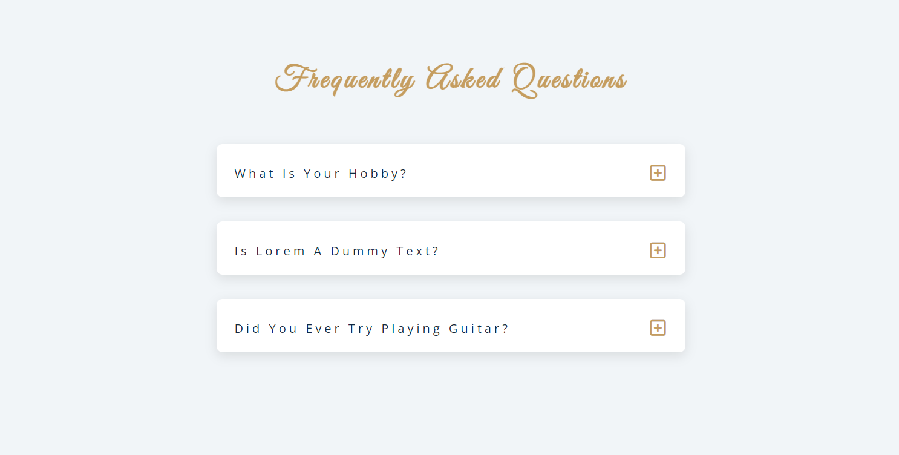
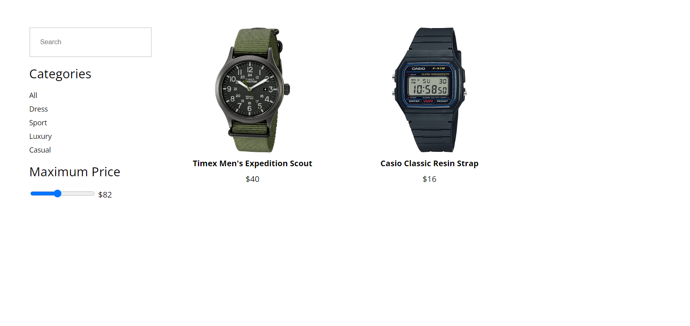
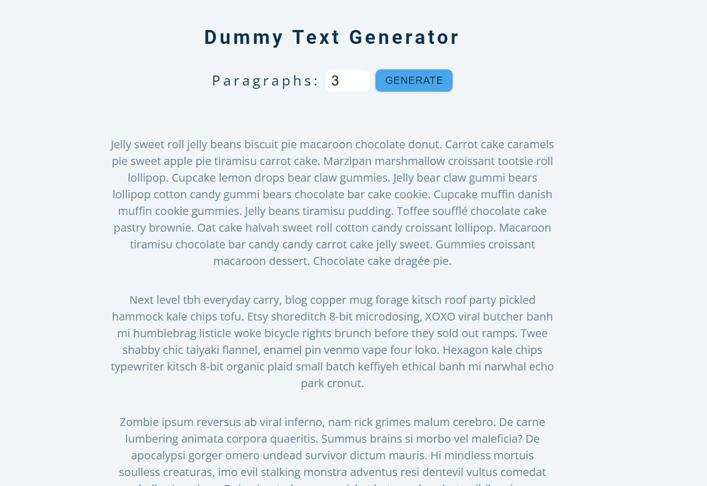
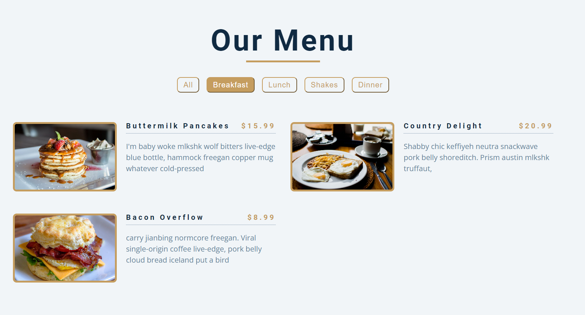
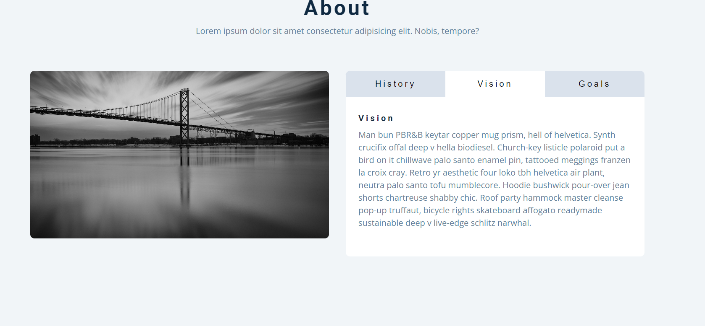

# Vanilla JS projects
## Installation and Setup
clone this repo `https://github.com/Kaung-Sintc/Vanilla-Javascript-projects.git` or download zip file

## Accordion

## Live Filter 

## Dummy text generator

## Dynamic data with menu

## Slider (carousel)

## To and fro with Tabs

